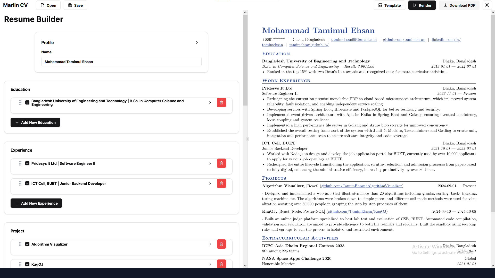

# Marlin CV

A simple resume builder with high ATS parse score

## Why this is made
Every job posting has different criteria and requirements. You need to tailor your resume based on those requirements. You need to change your projects, achievements, skills based on those. Also the job responsibilites need to be changed too! Example, you might have different CV for a job posting where Golang is required vs another where the position is based on Spring Boot. In this competetive market we apply for about 30 jobs per week! We needed some fast and easy way to change our resume. Thus Marlin CV was made.   

There are countless resume builder present in the web. Majority of them are paid. That still leaves us with some good open source and free builder. They are great but doesn't fullfil all the requirements.
## Functionalities
- No sign in required
- No server! Everything happens in your browser locally
- Load and save data locally
- High ATS parse score
- Select/ Deselect sections based on your requirement
- Reorder sections with easy to use drag and drop

## How to use
Go to [Marlin CV](https://buet-beecrypt.github.io/marlincv/). Open a file that you have saved earlier or start filling up the sections. Use the render button to render the resume. 

When you are done save it into a local file. To export it as pdf use the `Download as PDF` button. This will load into a new page. You have **Print** the page to export it into pdf.

## Known issues
- No option to add custom sections
- All the sections in profile are required. TODO: add options to make fields optional
- All the sections are required too. TODO: add options to remove sections
- Saving into file doesn't work for some of the browsers. Use updated chrome. TODO: make this feature browser compatible
- Download button doesn't automatically convert it into pdf. TODO: Fix the download feature

## Future updates we have in mind
- Add keyboard shortcuts for all buttons
- Adding new fields upon enter
- Fix the download feature
- Custom sections
- Add responsiveness
- Add mor templates
- Better CSS Support

